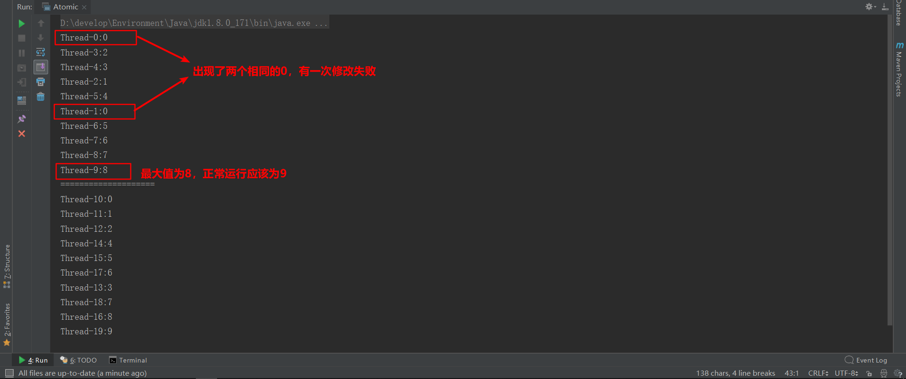

# JUC: java.util.concurrent

## Overview

Java 5.0提供了java.util.concurrent包，在此包中增加了在并发编程中常用的实用工具类，用于定义类似于线程的自定义子系统，包括线程池、异步 IO 和轻量级任务框架。提供可调的、灵活的线程池。还提供了设计用于多线程上下文中的 Collection 实现等。

## volatile与可见性问题

volatile关键字解决了内存可见性的问题

内存可见性问题：当多个线程操作共享数据时，操作时在各自的缓存区进行，操作结束后再反馈到主存中，因此造成了各个线程之间
彼此内存不可见。

volatile 和 synchronized的区别：

 - volatile只解决了内存可见性问题，但不具有原子性和互斥性
 
 - synchronized同时解决了内存可见性，也具有原子性和互斥性，但是程序执行效率比volatile低得多

## 原子变量与CVS算法

 一、原子性：即不可分割的步骤
 
 二、i++的原子问题
 
 int i=10;   i = i++;//最后，i=10
 
 实际执行顺序：int temp = i;   i = i+1;    i = temp;
 
 三、原子变量：
 
 java.util.concurrent.atomic包提供了常用的原子变量：如AtomicInteger、AtomicBoolean、AtomicReference<E>
 
 这些变量都是通过volatile + CAS算法实现的
 
 CAS：Compare And Swap
 
 举例：当线程修改某个变量之前先读取这个变量的值(假设为A)，修改预期值为V，而运算完后即将写入主存变量时再次读取变量(假设此时为B)，当A==B时，提交新值V，否则放弃此次修改，重新开始。
 
 使用原子变量解决了原子性问题，同时又比使用synchronized的效率高得多
 
Volatile.java文件中的例子，运行结果：

