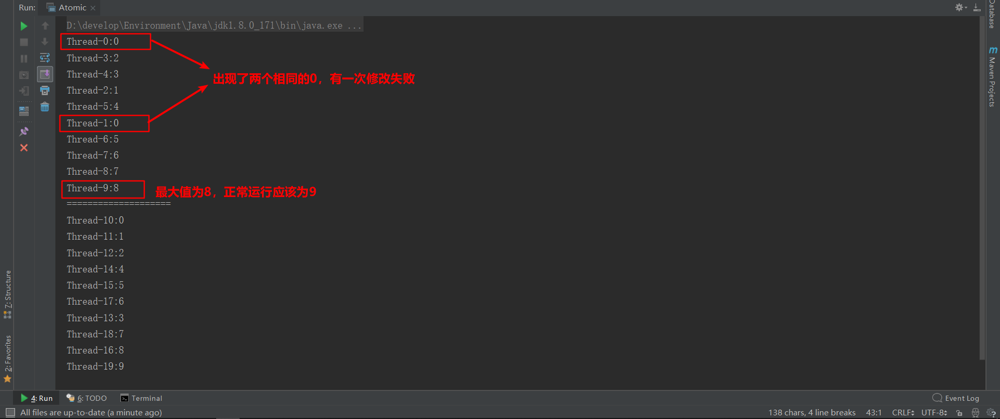

# JUC: java.util.concurrent

## Overview

Java 5.0提供了java.util.concurrent包，在此包中增加了在并发编程中常用的实用工具类，用于定义类似于线程的自定义子系统，包括线程池、异步 IO 和轻量级任务框架。提供可调的、灵活的线程池。还提供了设计用于多线程上下文中的 Collection 实现等。

## volatile与可见性问题

volatile关键字解决了内存可见性的问题

内存可见性问题：当多个线程操作共享数据时，操作时在各自的缓存区进行，操作结束后再反馈到主存中，因此造成了各个线程之间
彼此内存不可见。

volatile 和 synchronized的区别：

 - volatile只解决了内存可见性问题，但不具有原子性和互斥性
 
 - synchronized同时解决了内存可见性，也具有原子性和互斥性，但是程序执行效率比volatile低得多

## 原子变量与CVS算法

 一、原子性：即不可分割的步骤
 
 二、i++的原子问题
 
 int i=10;   i = i++;//最后，i=10
 
 实际执行顺序：int temp = i;   i = i+1;    i = temp;
 
 三、原子变量：
 
 java.util.concurrent.atomic包提供了常用的原子变量：如AtomicInteger、AtomicBoolean、AtomicReference<E>
 
 这些变量都是通过volatile + CAS算法实现的
 
 CAS：Compare And Swap
 
 举例：当线程修改某个变量之前先读取这个变量的值(假设为A)，修改预期值为V，而运算完后即将写入主存变量时再次读取变量(假设此时为B)，当A==B时，提交新值V，否则放弃此次修改，重新开始。
 
 使用原子变量解决了原子性问题，同时又比使用synchronized的效率高得多
 
Volatile.java文件中的例子，运行结果：


## 同步锁
**解决多线程安全问题的方式：**
jdk5.0之前使用synchronized关键字：
- 1、同步代码块
- 2、同步方法
jdk5.0开始
- 3、同步锁lock
**注意**：同步锁Lock是一个显示锁，需要通过lock()方法上锁，**必须**使用unlock()方法进行释放锁。

例：
```java
public class TestLock {
    public static void main(String[] args) {
        TicketSeller ticketSeller = new TicketSeller();
        new Thread(ticketSeller, "1号窗口").start();
        new Thread(ticketSeller, "2号窗口").start();
        new Thread(ticketSeller, "3号窗口").start();
    }
}

class TicketSeller implements Runnable {
    private int tickets = 100;
    private Lock lock = new ReentrantLock();
    @Override
    public void run() {
        while (true) {
            lock.lock();//上锁
            if (tickets > 0) {
                try {
                    System.out.println(Thread.currentThread().getName() + "完成售票，余票为:" + --tickets);
                } finally {
                    lock.unlock();
                }
            }
        }
    }
}
```

## 同步容器类
java.util.concurrent包中提供了多种并发容器类来改进同步容器的性能。

在JDK1.8之前，Concurrent的数据结构采用“锁分段”机制。即将数据结构分段，各段加独立的锁，不同的段之间能够并发。
从**JDK1.8**开始，这些线程安全的数据结构全部采用**CAS算法**替换原有的锁分段机制，保证多并发的同时效率更高。

CopyOnWriteArrayList/CopyOnWriteArraySet：“写入并复制”适合多迭代操作，添加操作多时效率较低。

## CountDownLatch闭锁
CountDownLatch是一个辅助同步类，在完成一组正在其他线程中执行的操作之前，它允许一个或多个线程一直等待。
用于
- 确保某个计算在其需要的所有资源都被初始化之后才执行
- 确保某个服务在其依赖的所有其他服务都已经启动之后才启动
- 等待直到某个操作所有参与者都准备就绪再继续执行

例：
```java
public class TestCountDownLatch {
    public static void main(String[] args) {
        final int threadNum = 5;
        final CountDownLatch latch = new CountDownLatch(threadNum);
        LatchDemo latchDemo = new LatchDemo(latch);
        long start = System.currentTimeMillis();
        for (int i = 0; i < threadNum; i++) {
            new Thread(latchDemo).start();
        }
        try {
            latch.await();
        } catch (InterruptedException e) {
            e.printStackTrace();
        }
        //等其他线程执行完毕时才执行下面的语句
        long end = System.currentTimeMillis();
        System.out.println("耗费时间：" + (end - start));
    }
}

class LatchDemo implements Runnable {
    private CountDownLatch latch;
    LatchDemo(CountDownLatch latch) {
        this.latch = latch;
    }
    @Override
    public void run() {
        try {
            for (int i = 0; i < 500; i++) {
                if (i % 2 == 0) {
                    System.out.println(i);
                }
            }
        } finally {
            latch.countDown();//倒计时减一
        }
    }
}
```